So, I was asked what my "platform" was, and I wasn't exactly sure what was meant. I can, however, discuss the tools and workflow involved, and take advantage of that discussion to actually refine it a bit. I might even create a dedicated page to it at some point.

So, let's lead off with a mindmap of the things involved. I'm not a marketing or content expert, so how I model this stuff might not feel right to people who know what they're doing. Ah well.

```dot
graph blog_tools {
    content -- {content_creation content_publication content_storage content_tracking content_social}
    subgraph clusterTracking {
        content_tracking [label="Tracking"]
        ga [label="Google Analytics"]
        content_tracking -- ga
        content_tracking -- jekyll [label="Jekyll\nOrganizes\ncontent"]
        content_tracking -- git [label="Git\ntracks\nchanges\nto content"]
    }
    subgraph clusterCreation {
        content_creation -- {content_editing content_rendering}
        content_editing -- vscode
        content_rendering -- graphviz [label="Graphviz\ngenerates\ncharts"]
        content_rendering -- markdown [label="MarkDown\nformats\ntext\nmedia"]
    }
    content_storage -- {git github ghp}


    jekyll -- rss [label="Jekyll Emits" constraint=no]

    subgraph clusterPublication {
        content_publication -- {jekyll ghp rss content_publication_ifttt}
        content_publication_ifttt -- { twitter facebook reddit linkedin} [label="IFTTT\nPosts\nto" constraint=no]
        content_publication_ifttt --  content_publication_buffer [label="IFTTT\nPosts\nto"]
        content_publication_ifttt -- rss [label="IFTTT Watches" constraint=no]
        content_publication_buffer -- { gplus } [label="Buffer Posts To" constraint=no]
        content_social -- {twitter facebook reddit linkedin gplus}
        gplus [label="Google+"]
        ghp [label="GitHub Pages"]
    }

    content_creation [label="Creation"]
    content_editing [label="Editing"]
    content_rendering [label="Rendering"]
    content_storage [label="Storage"]
    content_publication [label="Publication"]
    content_publication_buffer [label="Buffer"]
    content_publication_ifttt [label="IFTTT"]


    git -- ghp [label="GHP Draws its content from Git" constraint=no]
    git -- github [label="Github\nHosts\nGit\nRepositories" constraint=no]
    github -- ghp [label="GitHub Hosts\nGitHub Pages\nContent" constraint=no]

    vscode -- git [label="VSCode is the Primary Git Interface" constraint=no]
    vscode -- {graphviz markdown} [label="VSCode\nPreviews" constraint=no]
}
```

Incidentally, this is a classic case of "too many stories in one chart." I've got a draft in the works for talking about dealing with that.

Let's reorganize this a little bit with some flow.
