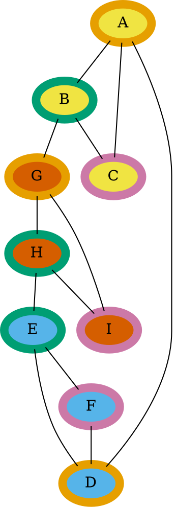
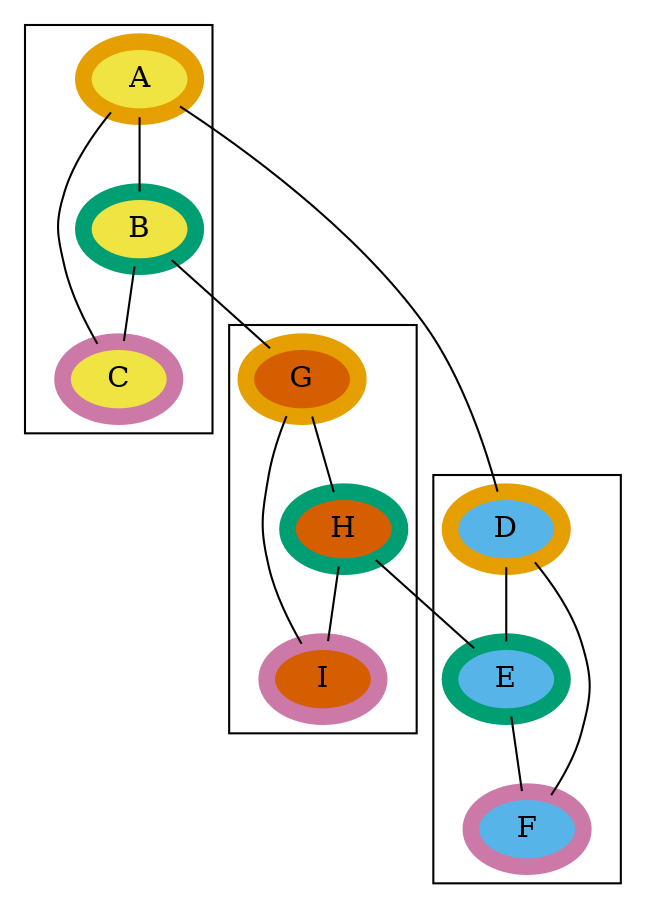

# Dot Language Basics Pt 2: Layout Engines, Clusters and Complicated Undirected Graphs

So, we covered simple, undirected graphs. Let's look at a couple more complicated cases, one with clustering and one without, so we can explore layout engines.

Remember, this is a _cyclic_ graph; within the graph, there exist two nodes which have more than one path to reach each other. In fact, it's pretty easy to identify three cyclic _subgraphs_ within the larger graph; `A-B-C`, `D-E-F` and `G-H-I`, and these smaller subgraphs are connected to each other. For visualizations' sake, I've added color information to each node, so the nodes will be easier to identify. Since we're dealing with three sets of three nodes, I've color-coded each node based on both which grouping it's part of, and which member of which grouping it is.

Now let's consider how we might draw attention to those subgraphs in the Dot language, by wrapping them up with clusters:

Let's see how Graphviz handles these two very similar graphs, using the default `dot` layout engine:

| Clustered | Non-clustered |
| --- | --- |
|  |  |

Notice how in both the clustered and non-clustered cases, `A-B-C` is near the top of the graph, `D-E-F` is near the bottom, and `G-H-I` is near the middle of the graph. However, in the clustered case, each of the three groups are much more compact.

Let's look at some other layout engines.

### `circo` Layout Engine

The `man` page description for `circo` is quite a mouthful, and reads:

> `circo` draws graphs using a circular layout (see [Six and  Tollis,  GD  '99  and ALENEX  '99](https://scholar.google.com/scholar?cluster=9494396738495206724&hl=en&as_sdt=0,23), and [Kaufmann and Wiese, GD '02](https://scholar.google.com/scholar?cluster=278384429215122705&hl=en&as_sdt=0,23). The tool identifies biconnected components and draws the nodes of the component on a  circle. The  block‐cut‐ point tree is then laid out using a recursive radial algorithm. Edge crossings within a circle are minimized by placing as many edges on the circle's perimeter as possible. In particular, if the component is outerplanar, the compo‐ nent will have a planar layout.

> If a node belongs to multiple non‐trivial biconnected components, the layout puts the node in one of them. By default, this is the first non‐trivial component found in the search from the root component.

Here's what that means in practice for these graphs:

| Clustered | Non-clustered |
| --- | --- |
|  |  |

The first thing you'll notice is that both renders look identical; the `cluster` keyword is not part of the Dot language itself, and so whether or not it does anything depends on the layout engine.

You can see the circle, and if you look, you can find the small subgraphs, but they're not obvioius. Notice `circo` did not choose to place the `A` node next to the `D` node, even though that would have resulted in shorter edges and a cleaner result. When Graphviz does that sort of thing, it usually means that placement of nodes is somehow dependent on the listing order of the nodes in the source file itself, and you can usually get the result you're looking for by reordering the content in the source file.

### `fdp` Layout Engine

The `man` page description for `fdp` is brief:

> `fdp` draws undirected graphs using a ``spring'' model. It relies  on  a  force‐directed  approach  in  the  spirit of Fruchterman and Reingold (cf. [Software‐Practice & Experience 21(11), 1991, pp. 1129‐1164](https://scholar.google.com/scholar?cluster=15659702693092844398&hl=en&as_sdt=0,23)).

Here's what that means for these graphs:

| Clustered | Non-clustered |
| --- | --- |
|  |  |

The clustered version of this graph looks very fine in `fdp`; the graph isn't quite as compact as it could be, but the clusters, at least, highlight the structure of the graph, and are themselves close to each other. The non-clustered version of this graph, however, has no obvious structure; the `A-B-C` triad overlaps the `G-H-I` triad, and looks like a mess.

### `neato` Layout Engine

The `man` page description for `neato` is also brief:

> `neato`  draws  undirected graphs using ``spring'' models (see [Kamada and Kawai, Information Processing Letters 31:1, April 1989](https://scholar.google.com/scholar?cluster=3559379059294964525&hl=en&as_sdt=0,23)).

This doesn't tell you much, but the results speak for themselves:

| Clustered | Non-clustered |
| --- | --- |
| ![There are three groupings of nodes making up small, cyclic graphs, A-B-C, D-E-F and G-H-I. Connecting these smaller cyclic graphs are are a small set of lines, A--D, B--G and H--E. D-E-F is at the top of the graph, A-B-C is at the lower-left, and G-H-I is at the lower right. D-E-F has its D node to the left, while A-B-C has its A node at the top, resulting in only a short distance for the A-D edge. D-E-F has its E node to the right, while G-H-I has its H node at the top, leading to a similarly short edge for E-H. A-B-C has its B node to the right, while G-H-I has its G node to the left, leading to a short B-G edge as well.]({{ site.url }}/assets/graphviz-dot-basics/complicated-undirected-graph-clustered-neato/complicated-undirected-graph-clustered-neato.svg) | ![There are three groupings of nodes making up small, cyclic graphs, A-B-C, D-E-F and G-H-I. Connecting these smaller cyclic graphs are are a small set of lines, A--D, B--G and H--E. D-E-F is at the top of the graph, A-B-C is at the lower-left, and G-H-I is at the lower right. D-E-F has its D node to the left, while A-B-C has its A node at the top, resulting in only a short distance for the A-D edge. D-E-F has its E node to the right, while G-H-I has its H node at the top, leading to a similarly short edge for E-H. A-B-C has its B node to the right, while G-H-I has its G node to the left, leading to a short B-G edge as well.]({{ site.url }}/assets/graphviz-dot-basics/complicated-undirected-graph-neato/complicated-undirected-graph-neato.svg) |

The first thing you should notice: There's no difference between the clustered and non-clustered versions. Just the same, you can _very_ clearly see all three cyclic subgraphs, they're well-spaced from each other, and their interconnections are very clear. The `neato` layout engine is very well-suited to this graph, clusters or no.

### `patchwork` Layout Engine

The `man` page description for `patchwork` describes something different:

> patchwork draws the graph as a  squarified  treemap  (see  [M.  Bruls  et  al., "Squarified treemaps", Proc. Joint Eurographics and IEEE TCVG Symp. on Visualization, 2000, pp. 33-42](https://scholar.google.com/scholar?cluster=16156845309181182620&hl=en&as_sdt=0,23)). The clusters of the graph are used to  specify  the tree.

| Clustered | Non-clustered |
| --- | --- |
|  |  |

All edge information appears to have been lost in this render. That said, compare the clustered and non-clustered versions. In the clustered version, you can clearly see `A-B-C` grouped, `D-E-F` grouped, and `G-H-I` grouped. This behavior is called [treemapping](https://en.wikipedia.org/wiki/Treemapping).

### `twopi` Layout Engine

The `man` page description for `twopi` describes it as:

> twopi draws graphs using a radial layout (see [G.  Wills,  Symposium  on  Graph Drawing  GD'97, September, 1997](https://scholar.google.com/scholar?cluster=13431559378469939199&hl=en&as_sdt=0,23)).  Basically, one node is chosen as the center and put at the origin.  The remaining nodes are placed on a sequence  of  con centric  circles  centered about the origin, each a fixed radial distance from the previous circle.  All nodes distance 1 from the center are placed  on  the first  circle; all nodes distance 1 from a node on the first circle are placed on the second circle; and so forth.

| Clustered | Non-clustered |
| --- | --- |
|  |  |

Unfortunately, this doesn't work well for this graph. If I had to guess, I'd suspect it's largely because the structure of the graph has symmetry; the layout engine is having a hard time finding a node that's meaningful. There are ways we could help it; you can [specify the center node](https://www.graphviz.org/doc/info/attrs.html#d:root), for example, and you can create [invisible](https://www.graphviz.org/doc/info/attrs.html#d:style) nodes and edges. Invisible nodes and edges are quite useful on their own, and we'll cover those in another post.
