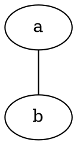
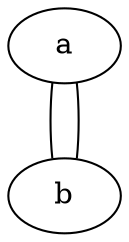
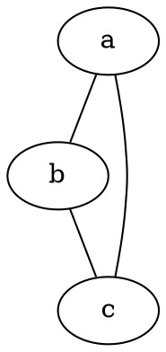
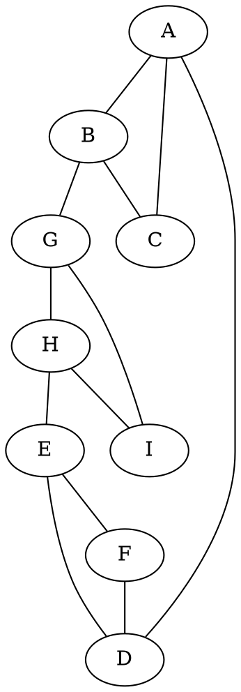
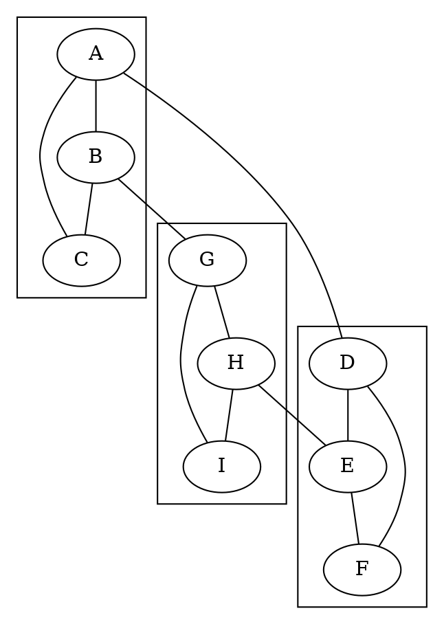

# Dot Language Basics Pt 1: Nodes, Edges and Simple Undirected graphs

I was asked to do a piece on the basics of Graphviz. I'm going to assume you can find a way to access the software; anything I say here will be out of date soon enough. So I'm going to talk about the Dot language itself, and how a handful of simple graphs behave in different layout engines.

## Graphviz and Dot are Different Things

No, they really are. Just like `cc` and the C language are different things, so are Graphviz and Dot. Graphviz is a distribution of programs that implement (and extend) the Dot language.

## A simple undirected graph

Wait, first, what's a graph? A graph is a set of nodes connected by edges. That's it. Here's an example:

So you see two nodes, named `a` and `b`, and the two nodes are connected by a single edge.

To create a node in Dot, all you need to do is mention it by name. This can be on its own, or while declaring an edge. So, this graph is identical to the above:

This also happens to be an _acyclic_ graph, which means there is only one path between any two nodes in the graph. It's trivial to make this into a _cyclic_ graph:

Now there are two edges between the same two nodes. Since there's more than one path between the two nodes, the graph is no longer acyclic. But drawing two edges directly between the same two nodes feels like cheating to illustrate the concept, so here's another example of a simple cyclic graph:

Now we have three nodes, `a`, `b`. `c`, and they form a loop. If you choose a node and follow the edges, you can (inevitably will, in this case) eventually wind up where you started. Since there's more than two paths between a pair of nodes, this graph is said to be _cyclic_.

For our purposes, we don't _usually_ care about whether a graph is cyclic or acyclic, but Graphviz can occasionally get confused with _directed_ cyclic graphs. More on that (well, directed graphs) later.

# Dot Language Basics Pt 2: Layout Engines, Clusters and Complicated Undirected Graphs

So, we covered simple, undirected graphs. Let's look at a more complicated case, so we can briefly explore the available layout engines.

Remember, this is a _cyclic_ graph; within the graph, there exist two nodes which have more than one path to reach each other. In fact, it's pretty easy to identify three cyclic _subgraphs_ within the larger graph; `A-B-C`, `D-E-F` and `G-H-I`, and these smaller subgraphs are connected to each other. Here's a render with the basic, default `dot` layout engine:

Notice how `A-B-C` is near the top of the graph, `D-E-F` is near the middle, and `G-H-I` is near the bottom of the graph. The edge `A-D` is much longer than any other edge, extending all the way from the top to the bottom of the graph. Let's look at some other layout engines.

### `circo` Layout Engine

The `man` page description for `circo` is quite a mouthful, and reads:

> `circo` draws graphs using a circular layout (see [Six and  Tollis,  GD  '99  and ALENEX  '99](https://scholar.google.com/scholar?cluster=9494396738495206724&hl=en&as_sdt=0,23), and [Kaufmann and Wiese, GD '02](https://scholar.google.com/scholar?cluster=278384429215122705&hl=en&as_sdt=0,23).  The tool identifies biconnected components and draws the nodes of the component on a  circle. The  block‐cut‐ point tree is then laid out using a recursive radial algorithm. Edge crossings within a circle are minimized by placing as many edges on the circle's perime‐ ter  as  possible.  In particular, if the component is outerplanar, the compo‐ nent will have a planar layout.

> If a node belongs to multiple non‐trivial biconnected components, the layout puts the node in one of them. By default, this is the first non‐trivial compo‐ nent found in the search from the root component.

Here's what that means in practice for this graph:

You can see the circle, and if you look, you can find the small subgraphs, but they're not obvioius. Notice `circo` did not choose to place the `A` node next to the `D` node, even though that would have resulted in shorter edges and a cleaner result. Which Graphviz does that sort of thing, it usually means that placement of nodes is somehow dependent on the listing order of the nodes in the source file itself, and you can usually get the result you're looking for by reordering the content in the source file.

### `fdp` Layout Engine

The `man` page description for `fdp` is brief:

> `fdp` draws undirected graphs using a ``spring'' model. It relies  on  a  force‐directed  approach  in  the  spirit of Fruchterman and Reingold (cf. ]]]]]]]][Software‐Practice & Experience 21(11), 1991, pp. 1129‐1164](https://scholar.google.com/scholar?cluster=15659702693092844398&hl=en&as_sdt=0,23)).

Here's what that means for this graph:

There's no real obvious visual structure to this render. `fdp` is obviously not well-suited to this graph without a lot of tuning work.

### `neato` Layout Engine

The `man` page description for `neato` is also brief:

> `neato`  draws  undirected graphs using ``spring'' models (see [Kamada and Kawai, Information Processing Letters 31:1, April 1989](https://scholar.google.com/scholar?cluster=3559379059294964525&hl=en&as_sdt=0,23)).

This doesn't tell you much, but the results speak for themselves:

![There are three groupings of nodes making up small, cyclic graphs, A-B-C, D-E-F and G-H-I. Connecting these smaller cyclic graphs are are a small set of lines, A--D, B--G and H--E. D-E-F is at the top of the graph, A-B-C is at the lower-left, and G-H-I is at the lower right. D-E-F has its D node to the left, while A-B-C has its A node at the top, resulting in only a short distance for the A-D edge. D-E-F has its E node to the right, while G-H-I has its H node at the top, leading to a similarly short edge for E-H. A-B-C has its B node to the right, while G-H-I has its G node to the left, leading to a short B-G edge as well.]({{ site.url }}/assets/graphviz-dot-basics/complicated-undirected-graph-neato/complicated-undirected-graph-neato.svg)

Here, you can _very_ clearly see all three cyclic subgraphs, they're well-spaced from each other, and their interconnections are very clear. The `neato` layout engine is very well-suited to this graph.

### `osage` Layout Engine

The `osage` layout engine isn't described in the `man` page for Graphviz, and its rendered output is identical to the default `dot` layout engine for this graph:

### `patchwork` Layout Engine

The `man` page description for `patchwork` describes something different:

> patchwork draws the graph as a  squarified  treemap  (see  [M.  Bruls  et  al., "Squarified treemaps", Proc. Joint Eurographics and IEEE TCVG Symp. on Visualization, 2000, pp. 33-42](https://scholar.google.com/scholar?cluster=16156845309181182620&hl=en&as_sdt=0,23)). The clusters of the graph are used to  specify  the tree.

All edge information appears to have been lost in this render.

### `twopi` Layout Engine

## With Clusters

Now we take some of the more tightly-connected portions of our graph and explicitly instruct our layout engines to cluster them.

Again, a `dot` rendering:

You can see how the three groups `ABC`, `DEF` and `GHI` are now clustered together, with boxes drawn arond them.

### `circo` Layout Engine

### `fdp` Layout Engine

### `neato` Layout Engine

### `osage` Layout Engine

### `patchwork` Layout Engine

### `sfdp` Layout Engine

### `twopi` Layout Engine
