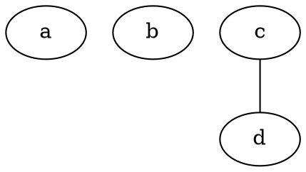
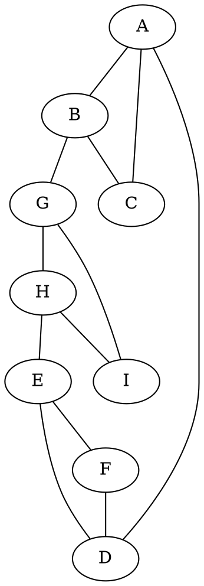
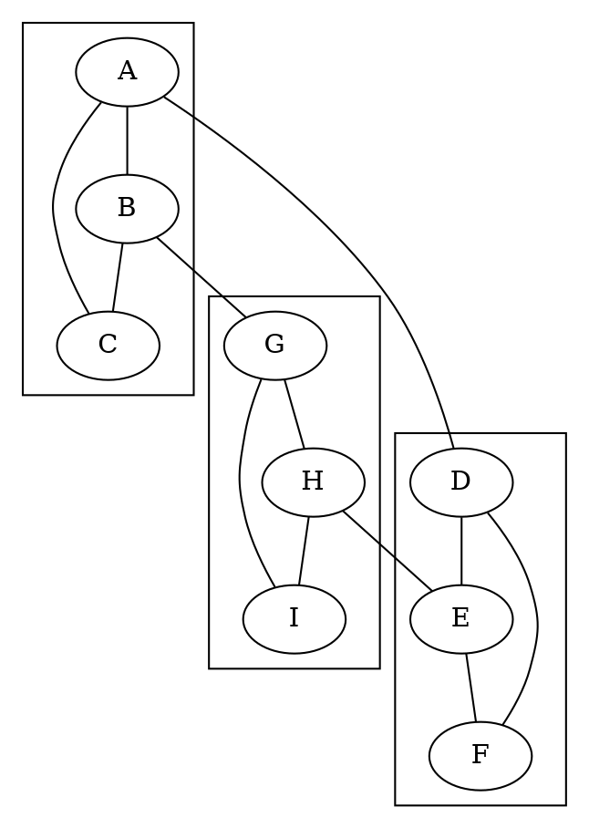

I was asked to do a piece on the basics of Graphviz. I'm going to assume you can find a way to access the software; anything I say here will be out of date soon enough. So I'm just going to talk about Graphviz and the Dot language itself.

## Graphviz and Dot are Different Things

No, they really are. Just like `cc` and the C language are different things, so are Graphviz and Dot. Graphviz is a distribution of programs that implement (and extend) the Dot language.

## A simple undirected graph

### Nodes

### Edges

## A more complicated undirected graph

### `circo` Layout Engine

### `fdp` Layout Engine

### `neato` Layout Engine

### `osage` Layout Engine

### `patchwork` Layout Engine

### `sfdp` Layout Engine

### `twopi` Layout Engine

## With Clusters

### `circo` Layout Engine

### `fdp` Layout Engine

### `neato` Layout Engine

### `osage` Layout Engine

### `patchwork` Layout Engine

### `sfdp` Layout Engine

### `twopi` Layout Engine
