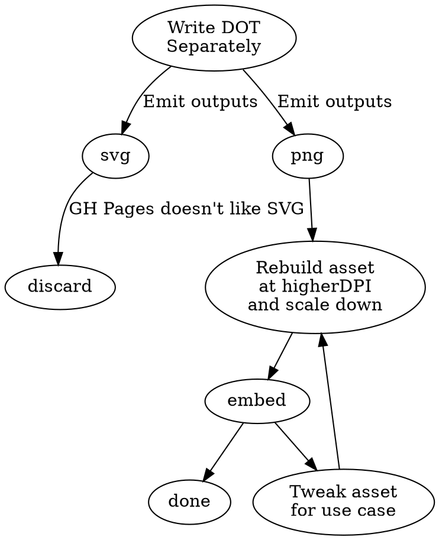

So, most of what I want to write about (if you dig around GitHub, you can find my backlog as a bunch of empty draft posts) involves Dot and GraphViz. But as nice as Jekyll and Markdown are for blog posts, the simplest workflow has me separately building Graphviz assets into PNG or SVG and embedding them, and then due to GitHub limitations, ditching the SVG version, generating the PNG version at a silly size and scaling it down:

...except here's the real problem: You're looking at a Dot representation of the workflow I just mentioned, not a visual representation.

What I _want_  is to be able to write Dot code inline with my posts, and have that content presented to _you_ visually.

It looks like what I really want is a Jekyll generator module that will let me convert inline Dot code like the above into something visual. [These exist](https://github.com/kui/jekyll-graphviz), but the ones I've found so far call out to an installation of Graphviz that's on the server to do the render work.

If I'm using somebody else's server (i.e. GitHub Pages, as I am at the moment), that's not a solution I care for; it means hoping their Jekyll setup permits callouts like that, hoping it has Graphviz installed, hoping it's the right version...if I was running a server, especially a free service, I would discourage users from executing arbitrary code.

Instead, I think what I'd like is a generator module that embeds [vis-js](http://viz-js.com/), a Javascript GraphViz implementation and has the render work performed on the client side. Falling back to a cruddy prerendered PNG if that's not possible.

I think that workflow would work a lot better for me. So instead of the Dot code you see above, you'd see a clean, SVG-defined inline image. And if that didn't get rendered, you'd at least see a static prerendered PNG that looks something like this:

So, you might not see quite what's wrong with that. Admittedly, it does look better than if I were to render that content on my work laptop. Here, the font kerning is horrible, but at least the font hinting works better. I've got a separate post (or few) on that topic.

Really, though, text rendering _belongs on the client_. The client knows about the display, knows about pixel size, shape, subpixel orientation, etc.

So, real quick, let's find out if client-side rendering is the proper solution to this.

Now, that renders fine using Jekyll and local preview on my laptop. But will it when I upload this doc to GitHub? I've heard it doesn't, but we'll have to see!
