# Sh-Zsh-Bash Chart Refactor

So, on the Grand Rapids Slack team, T.J. Zimmerman shared an interesting chart (originally by [Peter Ward](https://github.com/flowblok), from his blog post [here](https://blog.flowblok.id.au/2013-02/shell-startup-scripts.html)) which showed the behaviors of `sh`, `zsh` and `bash` as they built (and tore down) their environments in each of (non-)remote, (non-)login and (non-)interactice sessions. It was interesting in that it conveyed a huge amount of very useful information, but I was, well, offended that it didn't seem to do so well.

I haven't (yet) secured Peter's permission to embed his image here, so you'll have to go look at it in his blog post listed above. But I'll describe my issues with it here.

Before I continue, let be clear that he clearly did a huge amount of research building his post (and his charts), and the information he assembled visually is quite valuable. He gets the credit for the research.

That said...

## Concerns

1. I found the chart to be difficult to process, visually; I'm not in any degree color-blind, but the closely-spaced lines were difficult to follow, and more than once while rebuilding the chart, I followed the wrong branch at one point or another because of the color-coded switchback approach.
1. If you don't read the supporting text around the chart, it's not clear what the `/etc/bash.bashrc -> {~/.profile, ~/.bash_profile, ~/.bash_login} -> running` construct means; I initially thought it implied each of `{~/.profile, ~/.bash_profile, ~/.bash_login}` would be consumed in some unclear order, but it turns out that subsequent entries in the list are only consumed if earlier entries aren't found.
1. It's very difficult to follow the flow in reverse; choose a node further down in the chart, and try to walk the chart backwards. Perhaps you'll have an easier time than I did, but I found the edges crowded and the paths complex, espcially around the `bash`-specific paths.

I thought, "I can do better than this. It won't even take that long." Well, it took me over a week of spare cycles at home to get Graphviz to produce something I was satisfied with. I was at least half-wrong, but I certainly learned a lot along the way! And, boy, did it produce a lot of blog fodder.

## Results

Here's (mostly; I found and fixed a bug or two) the same data as in the original chart, but cleaned up:

![A chart showing each of Sh, Zsh and Bash session setup and teardown workflows. Each shell variant covered includes each combination of non-login and login, non-interactive and interactive sessions. Bash further includes non-remote vs remote workflows. Non-login, non-interactive workflows are drawn in black. Non-login, interactive workflows are drawn in orange. Login, non-interactive workflows are drawn in sky blue. Login, interactive workflows are drawn in sea green. On the left is a column labeling the workflow by shell type and session type. On the right is a column containing the label 'Running...'. In between are columns with the occasional label identifying other files that may be consumed. The Sh non-login, non-interactive workflow proceeds directly to the Running state. The Sh non-login, interactive workflow evaluates $ENV, and then proceeds to the Running state. The Sh login, non-interactive state evaluates ~/.profile, then proceeds to the Running state. The Sh login, interactive state evaluates ~/.profile, then $ENV, and finally proceeds to the Running state. The Zsh non-login, non-interactive workflow evaluates /etc/zshenv, then ~/.zshenv, and then proceeds to the Running state. The Zsh non-login, interactive workflow evaluates ~/etc/zshenv, then ~/.zshenv, and finally ~/.zshrc before proceeding to the Running state. The Zsh login, non-interactive state evaluates ~/etc/zshenv, then ~/.zshenv, then ~/.zprofile, ~/.zlogin, then enters the Running state, and finally evaluates ~/.zlogout. The Zsh login, interactive workflow evaluates ~/.etc/zshenv, ~/.zshenv, ~/.zprofile, ~/.zshrc, ~/.zlogin, and then the Running state before proceeding to evaluate ~/.zlogout. The Bash Non-remote, Non-login, non-interactive workflow evaluates $BASH_ENV before proceeding to the Running state. The Bash non-remote, non-login, non-interactive state evaluates /etc/bash.bashrc, then ~/.bashrc, and finally proceeds to the Running state. The Bash non-remote, login, non-interactive workflow evaluates /etc/profile. It then attempts to evaluate each of ~/.profile, ~/.bash_login and ~/.bash_profile. If it finds one, it skips the rest and evaluates $BASH_ENV before proceeding to the Running state and finally evaluating ~/.bash_logout. The Bash non-remote, login, interactive workflow evaluates /etc/profile. It then attempts to evaluate each of ~/.profile, ~/.bash_login and ~/.bash_profile. If it finds one, it skips the rest and proceeds to the Running state before evaluating ~/.bash_logout. The Bash remote, non-login, non-interactive workflow evaluates /etc/bash.bashrc, then ~/.bashrc before proceeding to the Running state. The Bash remote, non-login, interactive workflow proceeds immediately to a label reading 'No path', and does not proceed further. The Bash Remote Login Non-Interactive workflow evaluates /etc/profile. It then attempts to evaluate each of ~/.profile, ~/.bash_login and ~/.bash_profile. If it finds one, it skips the rest and evaluates $BASH_ENV before proceeding to the Running state and finally evaluating ~/.bash_logout. Where ~/.profile, ~/.bash_login and ~/.bash_profile are considered, the first two are represented by a trio of boxes arranged with the name of the file in one box, 'Found' and 'Not found' in the other box. Lines lead into the box naming the file, while lines lead out from the 'Found' or 'Not found' boxes to signify whether th file in question was found or not. The trio of boxes are bound tightly to each other, and both trios of boxes and the ~/.bash_profile are arranged in a common column, top to bottom, in the order they're considered. The same column is shared by the box trios found for similar logic sequences in each other workflow that needs to consider ~/.profile, ~/.bash_login and ~/.bash_profile. Files of the same (or sufficiently similar) name are placed in the same columns, with dotted lines connecting them. Every instance of /etc/zshenv is connected with a dotted line, as is every instance of ~/.zshenv, every instance of /etc/profile, ~/.bashrc, and so on.]({{ site.url }}/assets/sh-zsh-bash-refactor/refactor-output/refactor-output.svg)

So, again, we're covering each of `sh`, `zsh` and `bash`, with every combination of shell, (non)remote, (non)login and (non)interactive, where the shell supports the distinction. (Only `bash` recognizes remote shells.)

### Swimlanes

The first thing to notice is the use of swimlanes.


Instead of using a particular-colored line bouncing from file node to file node shared with other colored lines, we use a single swimlane to identify a single combination of session parameters. While this makes the chart decidedly less compact, it reduces a great deal of pressure on the layout engine, letting us do much more tweaking, and giving us the option of packing in more information without the output looking like a tangled mess of spaghetti.

#### Swimlanes Origins / Rationale

The use of swimlanes came out of my earlier attempt to reformulate the chart as a truth table. This was before I discovered the special conditional relationships between ~/.profile, ~/.bash_login and ~/.bash_profile. Earlier still, I'd attempted to replace the nodes in the original chart with clusters where each workflow would stop off at a workflow-dedicated node in a cluster corresponding to the file being evaluated. If you're having a difficult time picturing that, don't worry; so did the layout engine&emdash;it gave me a bunch of spaghetti, in large part because it tries to route edges around clusters, rather than through them.

### Granular Same-Rank Association

The columnar behavior is in part because Graphviz thinks of this as a directed graph, but the placement of this or that in a given column comes from using the `rank=same` attribute in an anonymous subgraph. The syntax looks like this:

```dot
    {
        rank=same
        sh_nn [label="Sh\nNon-Login\nNon-Interactive"]
        sh_ni [label="Sh\nNon-Login\nInteractive"]
        sh_ln [label="Sh\nLogin\nNon-Interactive"]
        sh_li [label="Sh\nLogin\nInteractive"]
    }
```

The above code results in all of the session-describing nodes in the same rank (and thus the same column, in this graph). In the following image, the above code is what builds the left-most column.


If I remove the samerank behavior from all but the Running column, this is the result:


Note that all of the empty stretches in the swimlanes have collapsed, with everything moving as close to the Running column as its swimlane allows. That's obviously much less clear than having the swimlane labels lined up, with empty space where a swimlane doesn't have a function in common with any other swimlane.

The other thing interesting about this approach is that while the above nodes will be in the same rank, we're not forcing them to be the _only_ things in that rank.

Let's return to the samerank behavior:


Now let's add a a few new nodes and edges, and another samerank grouping. This is largely the same as the above image, but I've de-emphasized (by making them dashed lines) the swimlane edges, emphasized the samerank groupings (by adding visible lines where there weren't any, and making all lines thick and solid), and made the nodes part of each grouping a different shape and color.

![In the top half of the image, there are four rows. The first row has a single node labeled A. The second row has a node labeled A, with a dashed arrow leading to a black circle with the label B. The third row has a black circle with the label B directly beneath the second row's black circle with the label B, and has a dashed line leading to a node labeled C. The fourth row has a node labeled A with a dashed line leading to a black circle labeled B (directly beneath the other two black circles), which has a dashed line leading to a node labeled C, which as a dashed line leading to a node labeled D. There is a solid black line joining the three black circles. In the next four rows, there are four swimlanes, all for Sh, one for Non-Login, Non-Interactive, one for Non-Login, Interactive, one for Login, Non-Interactive, and one for Login, Interactive. The contents are as in previous graphs. The first and last points in the swimlanes are lined up vertically. The first column contains the name of each swimlane. The first column's nodes are rectangles with a yellow background, and a thick yellow line joins them. The second column only has nodes in the final two swimlanes. The second column's nodes are reddish purple parallelograms labeled "~/.profile", and have a thick reddish-purple line joining them. The third column has nodes on the second and forth swimlanes. The nodes for the third column are vermillion diamonds labeled "$ENV". The fourth column's nodes are blue triangles, and there is a thick blue line joining them.]({{ site.url }}/assets/sh-zsh-bash-refactor/samerankplus/samerankplus.svg)

The set of black nodes and edges are held in place with two constraints; the `A -> B -> C -> D` row has as many ranks as the entire graph, so it extends end to end. The three black circles labeled "B" are held together via a `rank=same` directive, which is why the `B -> C` line is in the middle of the graph, occupying neither the first or fourth ranks.

Now, the set of nodes labeled "B" are interesting, because they occupy the same rank as the set of nodes labeled "~/.profile". Just because you set two different sets of nodes as `rank=same` doesn't mean each _set_ of nodes they'll occupy the same rank, but it doesn't mean they'll occupy different ranks, either.

This helps us avoid the use of _column_ headers, since we're able to reuse the same column for multiple groups of data, so long as those groups aren't in the same swimlane.

#### `rank=same` Origins / Rationale

I originally tried to use common nodes, and then clusters, to group common points in the different workflows, but I invariably wound up with spaghetti flows. When you use clusters, Graphviz will try to pull the nodes in a cluster into the smallest possible space, distorting the graph outside of the cluster. However, the anonymous subgraph using `rank=same` doesn't have that distorting effect; it only forces nodes into a given rank.

The more I used constraining tools like clusters and edges with `[constraint=true]` (which is the default), the harder it became to avoid spaghetti. I felt like the Emporer; the tighter I gripped, the more slipped through my grasp. The more I relaxed, the easier it became.

### Eye-Guiding, Non-Constraining Lines

Look for the small vertical dotted lines in this subset of the larger graph:


Each of these dotted lines are within a `rank=same` grouping, and they help draw your eye along that rank in order to identify the grouped elements. Since we group elemements of the same or similar roles, that helps you identify those roles as groupings without being too distracting from the swimlanes.

#### Eye-guide Origins / Rationale

Without the clear bounding boxes offered by clusters, I wanted a way to get visible groupings. Drawing non-constraining lines provided that. A dotted line is less distracting from the swimlanes than a solid line would be.

### Colors

Let's look at our chart without colors:

![A chart showing each of Sh, Zsh and Bash session setup and teardown workflows. Each shell variant covered includes each combination of non-login and login, non-interactive and interactive sessions. Bash further includes non-remote vs remote workflows. Non-login, non-interactive workflows are drawn in black. Non-login, interactive workflows are drawn in orange. Login, non-interactive workflows are drawn in sky blue. Login, interactive workflows are drawn in sea green. On the left is a column labeling the workflow by shell type and session type. On the right is a column containing the label 'Running...'. In between are columns with the occasional label identifying other files that may be consumed. The Sh non-login, non-interactive workflow proceeds directly to the Running state. The Sh non-login, interactive workflow evaluates $ENV, and then proceeds to the Running state. The Sh login, non-interactive state evaluates ~/.profile, then proceeds to the Running state. The Sh login, interactive state evaluates ~/.profile, then $ENV, and finally proceeds to the Running state. The Zsh non-login, non-interactive workflow evaluates /etc/zshenv, then ~/.zshenv, and then proceeds to the Running state. The Zsh non-login, interactive workflow evaluates ~/etc/zshenv, then ~/.zshenv, and finally ~/.zshrc before proceeding to the Running state. The Zsh login, non-interactive state evaluates ~/etc/zshenv, then ~/.zshenv, then ~/.zprofile, ~/.zlogin, then enters the Running state, and finally evaluates ~/.zlogout. The Zsh login, interactive workflow evaluates ~/.etc/zshenv, ~/.zshenv, ~/.zprofile, ~/.zshrc, ~/.zlogin, and then the Running state before proceeding to evaluate ~/.zlogout. The Bash Non-remote, Non-login, non-interactive workflow evaluates $BASH_ENV before proceeding to the Running state. The Bash non-remote, non-login, non-interactive state evaluates /etc/bash.bashrc, then ~/.bashrc, and finally proceeds to the Running state. The Bash non-remote, login, non-interactive workflow evaluates /etc/profile. It then attempts to evaluate each of ~/.profile, ~/.bash_login and ~/.bash_profile. If it finds one, it skips the rest and evaluates $BASH_ENV before proceeding to the Running state and finally evaluating ~/.bash_logout. The Bash non-remote, login, interactive workflow evaluates /etc/profile. It then attempts to evaluate each of ~/.profile, ~/.bash_login and ~/.bash_profile. If it finds one, it skips the rest and proceeds to the Running state before evaluating ~/.bash_logout. The Bash remote, non-login, non-interactive workflow evaluates /etc/bash.bashrc, then ~/.bashrc before proceeding to the Running state. The Bash remote, non-login, interactive workflow proceeds immediately to a label reading 'No path', and does not proceed further. The Bash Remote Login Non-Interactive workflow evaluates /etc/profile. It then attempts to evaluate each of ~/.profile, ~/.bash_login and ~/.bash_profile. If it finds one, it skips the rest and evaluates $BASH_ENV before proceeding to the Running state and finally evaluating ~/.bash_logout. Where ~/.profile, ~/.bash_login and ~/.bash_profile are considered, the first two are represented by a trio of boxes arranged with the name of the file in one box, 'Found' and 'Not found' in the other box. Lines lead into the box naming the file, while lines lead out from the 'Found' or 'Not found' boxes to signify whether th file in question was found or not. The trio of boxes are bound tightly to each other, and both trios of boxes and the ~/.bash_profile are arranged in a common column, top to bottom, in the order they're considered. The same column is shared by the box trios found for similar logic sequences in each other workflow that needs to consider ~/.profile, ~/.bash_login and ~/.bash_profile. Files of the same (or sufficiently similar) name are placed in the same columns, with dotted lines connecting them. Every instance of /etc/zshenv is connected with a dotted line, as is every instance of ~/.zshenv, every instance of /etc/profile, ~/.bashrc, and so on.]({{ site.url }}/assets/sh-zsh-bash-refactor/refactor-output-bw/refactor-output-bw.svg)

It's...readable, but not easily. Try reading the Sh, Non-Login, Non-Interactive line. Your eye may well jump lanes down to the interactive swimlane below as you try to trace the line. That's not great. While the graph is still clear and accurate, some color for _contrast_ would be useful. To help with that, I used four distinct colors for the chart, one per swimlane: 

![A chart showing each of Sh, Zsh and Bash session setup and teardown workflows. Each shell variant covered includes each combination of non-login and login, non-interactive and interactive sessions. Bash further includes non-remote vs remote workflows. Non-login, non-interactive workflows are drawn in black. Non-login, interactive workflows are drawn in orange. Login, non-interactive workflows are drawn in sky blue. Login, interactive workflows are drawn in sea green. On the left is a column labeling the workflow by shell type and session type. On the right is a column containing the label 'Running...'. In between are columns with the occasional label identifying other files that may be consumed. The Sh non-login, non-interactive workflow proceeds directly to the Running state. The Sh non-login, interactive workflow evaluates $ENV, and then proceeds to the Running state. The Sh login, non-interactive state evaluates ~/.profile, then proceeds to the Running state. The Sh login, interactive state evaluates ~/.profile, then $ENV, and finally proceeds to the Running state. The Zsh non-login, non-interactive workflow evaluates /etc/zshenv, then ~/.zshenv, and then proceeds to the Running state. The Zsh non-login, interactive workflow evaluates ~/etc/zshenv, then ~/.zshenv, and finally ~/.zshrc before proceeding to the Running state. The Zsh login, non-interactive state evaluates ~/etc/zshenv, then ~/.zshenv, then ~/.zprofile, ~/.zlogin, then enters the Running state, and finally evaluates ~/.zlogout. The Zsh login, interactive workflow evaluates ~/.etc/zshenv, ~/.zshenv, ~/.zprofile, ~/.zshrc, ~/.zlogin, and then the Running state before proceeding to evaluate ~/.zlogout. The Bash Non-remote, Non-login, non-interactive workflow evaluates $BASH_ENV before proceeding to the Running state. The Bash non-remote, non-login, non-interactive state evaluates /etc/bash.bashrc, then ~/.bashrc, and finally proceeds to the Running state. The Bash non-remote, login, non-interactive workflow evaluates /etc/profile. It then attempts to evaluate each of ~/.profile, ~/.bash_login and ~/.bash_profile. If it finds one, it skips the rest and evaluates $BASH_ENV before proceeding to the Running state and finally evaluating ~/.bash_logout. The Bash non-remote, login, interactive workflow evaluates /etc/profile. It then attempts to evaluate each of ~/.profile, ~/.bash_login and ~/.bash_profile. If it finds one, it skips the rest and proceeds to the Running state before evaluating ~/.bash_logout. The Bash remote, non-login, non-interactive workflow evaluates /etc/bash.bashrc, then ~/.bashrc before proceeding to the Running state. The Bash remote, non-login, interactive workflow proceeds immediately to a label reading 'No path', and does not proceed further. The Bash Remote Login Non-Interactive workflow evaluates /etc/profile. It then attempts to evaluate each of ~/.profile, ~/.bash_login and ~/.bash_profile. If it finds one, it skips the rest and evaluates $BASH_ENV before proceeding to the Running state and finally evaluating ~/.bash_logout. Where ~/.profile, ~/.bash_login and ~/.bash_profile are considered, the first two are represented by a trio of boxes arranged with the name of the file in one box, 'Found' and 'Not found' in the other box. Lines lead into the box naming the file, while lines lead out from the 'Found' or 'Not found' boxes to signify whether th file in question was found or not. The trio of boxes are bound tightly to each other, and both trios of boxes and the ~/.bash_profile are arranged in a common column, top to bottom, in the order they're considered. The same column is shared by the box trios found for similar logic sequences in each other workflow that needs to consider ~/.profile, ~/.bash_login and ~/.bash_profile. Files of the same (or sufficiently similar) name are placed in the same columns, with dotted lines connecting them. Every instance of /etc/zshenv is connected with a dotted line, as is every instance of ~/.zshenv, every instance of /etc/profile, ~/.bashrc, and so on.]({{ site.url }}/assets/sh-zsh-bash-refactor/refactor-output/refactor-output.svg)

Each color is keyed off of whether or not a swimlane corresponds to a login session, and whether or not a swimlane corresponds to an interactive session. The four colors are drawn from a [colorblind-safe palette](http://jfly.iam.u-tokyo.ac.jp/color/#pallet).

#### Colors Origins / Rationale

I'm not fond of using color for encoding information without an alternate way to present that same information; colorblindness is a real thing, and keying information off of color can make the chart more difficult to read. The chart that inspired this one relied on color as the sole way of distinguishing program flow, and was difficult to follow, as a result.

Colors should be used for accenting and supplementing information, not as a primary differentiator; this is called [redundant coding](http://jfly.iam.u-tokyo.ac.jp/color/#redundant1). (Instead of using different shapes, I use spacial separation of swimlanes and clear labels for my primary indicators. That said, the black-and-white version might be able to take advantage of more mechanisms. I'm pleased enough with the colorblind-safe palette, though.)

[Here is a very good resource](http://jfly.iam.u-tokyo.ac.jp/color/) for considering how to present data with consideration of colorblindness. It also contains the palette of colors I drew from for this chart.

### HTML-like labels for Choices

The original chart had choices presented in it, but it wasn't clear that that's what they were unless you read the supporting text. Here, we use HTML-like labels in order to use tables to get us nodes with multiple inputs and outputs. This lets us label a path without using edge labels.

![A single swimlane is shown, for Bash non-remote, login, interactive. The flow proceeds from the label to /etc/profile. From there, to ~/.profile. If ~/.profile is found, flow proceeds to the Running state and then to ~/.bash_logout. If ~/.profile is not found, flow proceeds to ~/.bash_login. If ~/.bash_login is found, flow proceeds to the Running state and then to ~/.bash_logout. If ~/.bash_login is not found, flow proceeds to ~/.bash_profile, then to the Running state and finaly to ~/.bash_logout. ~/.profile and ~/.bash_login are represented by boxes with three cells. Flow passes into the box at the cell labeled after the file in question. Flow leaves the box through cells labeled "Found" and "Not found", with lines drawn to wherever flow moves next.]({{ site.url }}/assets/sh-zsh-bash-refactor/choices-swimlane/choices-swimlane.svg)

Notice the boxes for `~/.profile` and `~/.bash_login`. See how flow passes into the box at the cell labeled after the file in question, and flow leaves the box through cells labeled "Found" and "Not found", with lines drawn to wherever flow moves next. These are HTML-like labels, specifically taking advantage of tables and _ports_. The Dot language doesn't actually implement HTML, nor does it fully implement HTML tables. It does, however, _extend_ tables with ports; you can add a `port="some_string"` attribute to a `td` element in an HTML-like label, and then address that specific _port_ when drawing edges, using syntax like `node1:my_port -> node2:my_other_port`, or even `node1:port1 -> node1:port2`

Here's the source code for the above swimlane. See if you can identify where the ports are created, and where they're used in the edges.

```dot
digraph {
    node [label="\N" shape=none]
    edge [style=dotted constraint=false dir=none]
    rankdir=LR

    bash_nli [label="Bash\nNon-Remote\nLogin\nInteractive"]
    bash_nli_etc_profile [label="/etc/profile"]
    bash_nli_home_bash_login_case  [label=< <table border='0' cellborder='1' cellspacing='0'><tr><td rowspan='2' port='in'>~/.bash_login</td><td port='found'>Found</td></tr><tr><td port='not_found'>Not found</td></tr></table> > shape=none]
    bash_nli_home_bash_profile [label="~/.bash_profile"]
    bash_nli_running_to_logout [label="Running..."]
    bash_nli_logout [label="~/.bash_logout"]
    bash_nli_home_profile_case [label=< <table border='0' cellborder='1' cellspacing='0'><tr><td rowspan='2' port='in'>~/.profile</td><td port='found'>Found</td></tr><tr><td port='not_found'>Not found</td></tr></table> > shape=none]
    
    edge [color="#009e73" penwidth=5 constraint=true style=solid dir=forward]

    bash_nli -> bash_nli_etc_profile -> bash_nli_home_profile_case:in
    bash_nli_home_bash_login_case:found -> bash_nli_running_to_logout
    bash_nli_home_bash_login_case:not_found -> bash_nli_home_bash_profile -> bash_nli_running_to_logout 
    bash_nli_home_profile_case:found -> bash_nli_running_to_logout
    bash_nli_home_profile_case:not_found -> bash_nli_home_bash_login_case:in
    bash_nli_running_to_logout -> bash_nli_logout
}
```



### HTML-like labels for Choices Origins / Rationale

I'd actually completed the chart using a very different style before I realized I was missing the choices, and rewrote the chart to identify the decision points. To label the decision points, I tried using cluster, nodes as labels, nodes-as-labels with some deliberate coalescing of shortcut paths...I even tried using edge labels. I couldn't make the chart come out clean. Finally, I tried using HTML labels with ports, and it gave me a result compact enough to make a chart that _worked_ and didn't have edge spaghetti everywhere.

The big advantage to using HTML-like labels and tables, in this case, is that the layout engine treats the entire label as a single node, for the purpose of placing nodes. That makes ranking much easier to manage, as a single piece of information doesn't have to spread across multiple ranks; I had tried using both `rank=same` and clusters to contain _that_ problem, and I simply wound up with more edge spaghetti as the layout engine either chose strange circumlocutious paths for edges, or tried running edges around clusters in ways that made edges difficult to distinguish from each other. Ultimately, being able to pack all of that information cleanly into the boundary of a single node let me build a much cleaner graph.

### Same-rank, Constraining Edges

Notice how there's a very definite sequence to the ordering of the swimlanes?

| Shell | Remote | Login | Interactive |
| ---:|:---:|:---:|:---:|
| Sh | N/A | No | No |
| Sh | N/A | No | **Yes** |
| Sh | N/A | **Yes** | No |
| Sh | N/A | **Yes** | **Yes** |
| Zsh | N/A | No | No |
| Zsh | N/A | No | **Yes** |
| Zsh | N/A | **Yes** | No |
| Zsh | N/A | **Yes** | **Yes** |
| Bash | No | No | No |
| Bash | No | No | **Yes** |
| Bash | No | **Yes** | No |
| Bash | No | **Yes** | **Yes** |
| Bash | **Yes** | No | No |
| Bash | **Yes** | No | **Yes** |
| Bash | **Yes** | **Yes** | No |
| Bash | **Yes** | **Yes** | **Yes** |

That sequence was maintained by using a constraining edge on each of the `Running...` nodes:

```dot
    {
        rank=same
        edge [constraint=true]
        node [label="Running..."]
        sh_nn_running ->
        sh_ni_running ->
        sh_ln_running ->
        sh_li_running ->
        zsh_nn_running ->
        zsh_ni_running ->
        zsh_ln_running ->
        zsh_li_running ->
        bash_nnn_running ->
        bash_nni_running ->
        bash_nln_running ->
        bash_nli_running ->
        bash_rnn_running ->
        bash_rln_running ->
        bash_rli_running
    }
```

This told the layout engine that there was a deliberate ordering there, and the layout engine sought to maintain it. Here's what the graph looks like without that constraining edge:


Note that Zsh floated to the top, and the Sh swimlanes are split to both before and after the Bash swimlanes. You can even see how some of the dotted lines are no longer simply vertical; they have to jump over other nodes in the same rank in order to reach the rest of their group. There's a reason it's ordered like that, but I don't understand it well enough to tell you how to predict it.

_There is one other_ constraining samerank edge in the graph, though:

```dot
        edge [constraint=true style=invis]
        bash_rnn -> bash_rni -> bash_rln
```

If you look at the swimlane for Bash/Remote/Non-Login/Interactive, you'll notice is't quite short. In fact, it goes straight to "No path", and doesn't reach the Running state. Since the Running state is where we're applying all of our samerank edge constraints, this particular swimlane doesn't get picked up by it. So we anchor it to its neighbors (Bash/Remote/Non-Login/Non-Interactive and Bash/Remote/Login/Non-Interactive) in order to control its vertical placement.

### Rank-anchoring

(Note the samerank needed to draw $ENV to the end of the chart.)