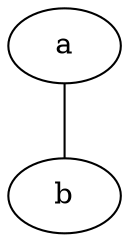
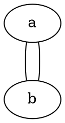
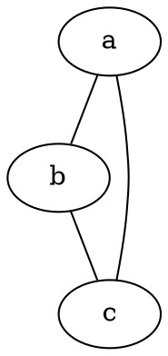

I was asked to do a piece on the basics of Graphviz. I'm going to assume you can find a way to access the software; anything I say here will be out of date soon enough. So I'm going to talk about the Dot language itself, and how a handful of simple graphs behave in different layout engines.

## Graphviz and Dot are Different Things

No, they really are. Just like `cc` and the C language are different things, so are Graphviz and Dot. Graphviz is a distribution of programs that implement (and extend) the Dot language.

## A simple undirected graph

Wait, first, what's a graph? A graph is a set of nodes connected by edges. That's it. Here's an example:

So you see two nodes, named `a` and `b`, and the two nodes are connected by a single edge.

To create a node in Dot, all you need to do is mention it by name. This can be on its own, or while declaring an edge. So, this graph is identical to the above:

This also happens to be an _acyclic_ graph, which means there is only one path between any two nodes in the graph. It's trivial to make this into a _cyclic_ graph:

Now there are two edges between the same two nodes. Since there's more than one path between the two nodes, the graph is no longer acyclic. But drawing two edges directly between the same two nodes feels like cheating to illustrate the concept, so here's another example of a simple cyclic graph:

Now we have three nodes, `a`, `b`. `c`, and they form a loop. If you choose a node and follow the edges, you can (inevitably will, in this case) eventually wind up where you started. Since there's more than two paths between a pair of nodes, this graph is said to be _cyclic_.

For our purposes, we don't _usually_ care about whether a graph is cyclic or acyclic, but Graphviz can occasionally get confused with _directed_ cyclic graphs. More on that (well, directed graphs) later.
